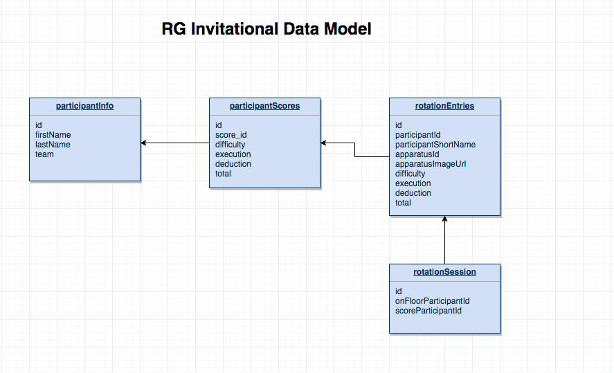
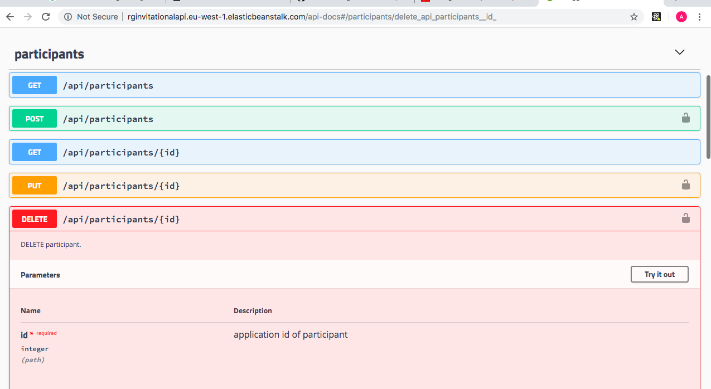
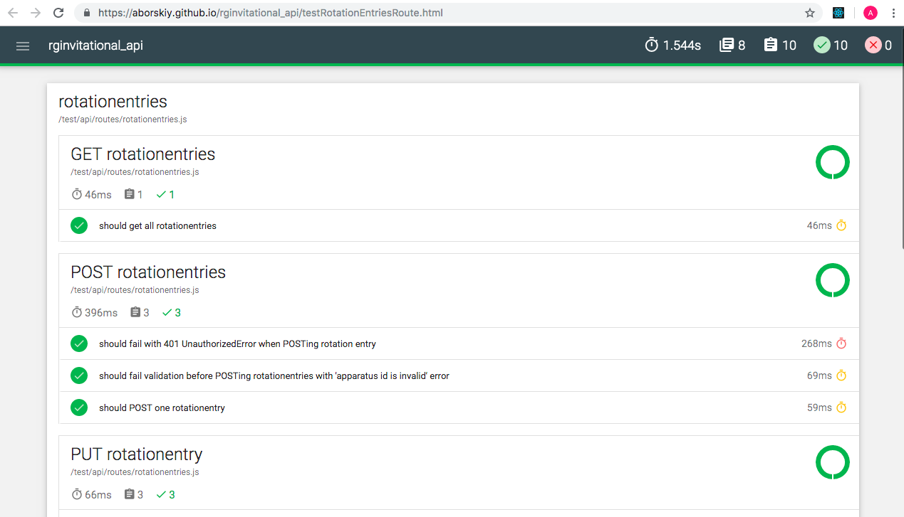
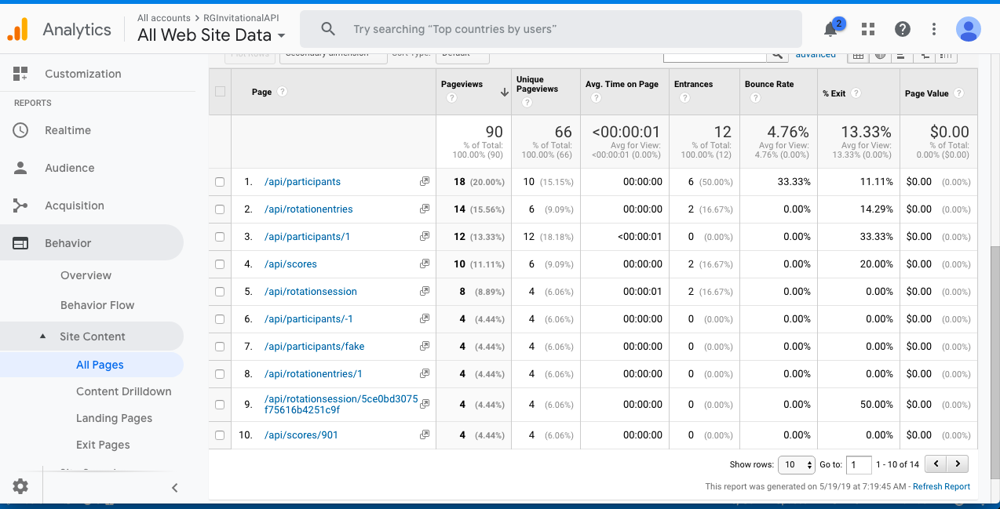

# Assignment 2 - ReactJS App & API.

Name: Alex Borskiy

## Overview.
The application is a web API for resources needed to support administrative functions for Rhytmic Gymnastics competition.  The application provides access to CRUD operations needed to maintain resources via REST interface.

 ###### Application Features
 
 + Application provides REST services to maintain participant information, scores and rotation:
   * /api/participants
   * /api/scores 
   * /api/rotationentries
   * /api/rotationsession
 
 + Bulk operations
 
    In addition to standard REST GET, POST, PUT, DELETE types, "rotationentries" service also have bulk POST and DELETE operations, allowing to insert and delete multiple entries in one request using custom header "x-action" with value "bulk".

 + API Protection

    Application uses 3rd party application Auth0 to allow access to some resources only by approved calling applications.

 + Validation

    Application uses express-validator middlewares to validate request body and parameters.

 + Separation of concerns

    The routing, data validations, db interactions and data representations are separated in the different layers in the code. 
    There are separate folders in the code for different layer: routes, controllers, validators, models.  
    The routers programs use express router and chain necessary middleware on REST url path.
    The middleware is used to perform the following functions:
    1. Authentication - checks Access Token existence and verifies it against
        the Auth0 JSON Web Key Set.  This middleware uses 3rd party npm packages
        express-jwt, express-jwt-authz, jwks-rsa.

    2.  Check results of authentication. Custom build middleware to check results of Authentication and to set HTTP response status to 401 in case of Unauthorized Error.

    3.  Check for custom header X-ACTION.  Custom build middleware to intercept http headers and check for presence of X-ACTION header with value "bulk".  This middleware directs processing to different controllers.

    4.  Data validations.  There is a separate validator for each resource.  This middleware uses 3rd party npm package express-validator and performs basic checks on incoming data.    

    5.  Check validation result.  Custom build middleware which checks results of validation and sets HTTP response status to 422 in case of invalid request.

    6.  Database interaction.  These are controllers middleware which interact with Mongoose models to perform Create, Read, Update, Delete database operations.

 + Documentation via Swagger /api-docs.

    Application provides documentation about all available REST services.  The documentation can be accessed real-time at [http://rginvitationalapi.eu-west-1.elasticbeanstalk.com/api-docs](http://rginvitationalapi.eu-west-1.elasticbeanstalk.com/api-docs).  The documentation is generated using Express Swagger Generator npm package automatically. 


 + Testing reports.

    Mochawesome reports are produced after each build and available on-line at: 
    - [https://aborskiy.github.io/rginvitational_api/testParticipantRoute.html](https://aborskiy.github.io/rginvitational_api/testParticipantRoute.html)
    - [https://aborskiy.github.io/rginvitational_api/testRotationEntriesRoute.html](https://aborskiy.github.io/rginvitational_api/testRotationEntriesRoute.html)
    - [https://aborskiy.github.io/rginvitational_api/testRotationSessionRoute.html](https://aborskiy.github.io/rginvitational_api/testRotationSessionRoute.html)
    - [https://aborskiy.github.io/rginvitational_api/testScoresRoute.html](https://aborskiy.github.io/rginvitational_api/testScoresRoute.html)
    - [https://aborskiy.github.io/rginvitational_api/unit-test.html](https://aborskiy.github.io/rginvitational_api/unit-test.html)

+ Analytics.

    Application is integrated with Google Analytics to track all incoming requests.  3rd party npm package is used to do tracking in the application (universal-analytics)[https://www.npmjs.com/package/universal-analytics].  The tracking code is encapsulated within custom express middleware - api/analytics/tracker.js 

## Installation requirements.
Assumes that node.js is installed on your machine.  Please refer to [Node Page](https://nodejs.org/en/) if node needs to be installed.

- download the source code, open terminal and navigate to rginvitational_api folder 

- verify that npm is installed.
```
npm -v
```

- install required packages
```
npm install
```

- start application
```
npm start
```

###### Data Model Diagram



###### Data Model Sample Data

[participants sample data](seed/participantsInfoData.js)\
[participants score data](seed/participantsScoreData.js)\
[rotation entries data](seed/rotationEntriesData.js)

# Web API Endpoint Reference
Web API allows CRUD operations on 4 resources: participants, scores, rotationentries, rotationsession.

## Web API Install and Operation

Please use [installation-requirements](https://github.com/aborskiy/rginvitational_api#installation-requirements) section for details on how to install and start the application.

"npm start" command executes "nodemon -r esm index.js" script.  The nodemon runs the code and automatically restarts when code changes.  The "-r" flag is used to require "esm" module on start.
The "esm" module is "A fast, production ready, zero-dependency ES module loader for Node 6+!". 

## API Design

| Participants Services |  Description |
| -- | -- |
| **GET** /api/participants |get all participants |
| **GET** /api/participants/{id} |get participant by id |
| **POST** /api/participants |post participant |
| **PUT** /api/participants/{id} | update participant |
| **DELETE** /api/participants/{id} | delete a participant |

| Rotationentries Services |  Description |
| -- | -- |
| **GET** /api/rotationentries |get all rotationentries |
| **PUT** /api/rotationentries/{id} |update rotation entry by id |
| **DELETE** /api/rotationentries{id} |delete rotation entry by id |
| **POST** /api/rotationentries | post all rotationentries|
| **DELETE** /api/rotationentries | delete all rotationentries|

| Rotationsession Services |  Description |
| -- | -- |
| **GET** /api/rotationsession |get rotationsession |
| **POST** /api/rotationsession |post rotationsession |
| **PUT** /api/rotationsession/{id} |update rotation session |
| **DELETE** /api/rotationsession/{id} |delete rotation session |

| Scores Services |  Description |
| -- | -- |
| **GET** /api/scores |get all scores |
| **POST** /api/scores |post new score |
| **PUT** /api/scores/{id} |update score by id |
| **DELETE** /api/scores/{id} |delete score by id |

This information is also available through automatically generated swagger documentation http://rginvitationalapi.eu-west-1.elasticbeanstalk.com/api-docs.
Swagger documentation also provides the sample of request/response and allows to try out each request.

##### Swagger Documentation view.


## API Configuration

The application uses the following environment variables which are configured for AWS Elaticbeanstalk container.\
To run application locally, the same envrionment variable can be set in .env file.

NODE_ENV=production\
PORT=8080\
HOST=localhost\
PRODHOST=rginvitationalapi.eu-west-1.elasticbeanstalk.com  - not needed to install locally

mongoDB=mongodb+srv://RGInvitational_API:??????????????????????????.mongodb.net/rginvitational?retryWrites=true

##### authentication middleware
EXPRESS_JWT_SECRET_CACHE=true\
EXPRESS_JWT_SECRET_RATELIMIT=true\
EXPRESS_JWT_SECRET_JWKSREQUESTSPERMINUTE=5
        
EXPRESS_JWT_SECRET_JWKSURI=https://**************.auth0.com/1234567/secret.json
JWT_AUDIENCE=https://**********************.auth0.com/api/v2/
JWT_ISSUER=https://****************************.auth0.com/
JWT_ALGORITHM=RS256

##### test access token
TEST_ACCESS_URL=https://**********************.auth0.com/oauth/token
TEST_ACCESS_GRANT_TYPE=client_credentials
TEST_ACCESS_CLIENT_ID=**************
TEST_ACCESS_CLIENT_SECRET=**********************
TEST_ACCESS_AUDIENCE=https://****************.auth0.com/api/v2/

##### 
GTAG=UA-#########-#

## Security and Authentication
All application POST, PUT, DELETE REST services are protected and require calling application to be authenticated.  
The authorization and authentication are done using external vendor Auth0. 
Here is the sequence of interactions used to authenticate API call. 
1.  Auth0 authenticates the user (user is authenticated when he/she signs in on front-end page).
2.  If user is successfully identified, Auth0 responds with temporary Access Token for API application.  
3.  Front-end application then calls this API application, passing Access Token in HTTP Authorization header.
4.  The API application validates the Access Token using express-jwt npm package.

The application uses 3rd party npm packages to work with Auth0:
1. express-jwt - to validate Access Token.
2. express-jwt-authz - to check scope.
3. jwks-rsa - to get public key and complete verification

## Testing

The tests are created for each model used in application.
Within the test suite for each model, the following validations are done:
1.  successful creation of model object
2.  presence of each field on created model object
3.  valid type of each field on created model object
4.  values in few fields are equal to expected values
5.  that errors are produced when required fields are not present on created object

The tests are created for each API route used in the application.
Within the test suite for each route, the following tests are done:
+  the test for all API methods (GET, POST, PUT, DELETE).

+  GET requests tests
    checked for HTTP status 200 and for body length to be greater than 0

+  POST requests tests
    - with invalid access token are checked to produce HTTP 401 response status and response body with UnauthorizedError   
    - with at least one invalid value in request body are checked to produce HTTP 422 response status and error              message in response body describing what field did not pass validation, for example, 'name does not exist' or          'apparatus id is invalid, should be floor, hoop, rope, ribbon'             
    - with valid body are checked to produce HTTP response status 201 and to have object id in response body.

+  POST BULK requests tests
    - with valid body are checked to produce HTTP response status 201.


+  PUT requests tests
    - with valid body are checked to produce HTTP response status 200 and to have object id in response body.
    - with not existing parameter id are checked to produce HTTP response status 404.
    - with not numeric parameter id are checked to produce HTTP response status 422 - validation error.

+  DELETE requests tests
    - with valid parameter id are checked to produce HTTP response status 200 and to have object id in response body.

+  DELETE BULK requests tests
    - are checked to produce HTTP response status 200.

Test reports are produced with mochawesome and are published to github pages after each build.
The reports can be viewed at:

https://aborskiy.github.io/rginvitational_api/testParticipantRoute.html

https://aborskiy.github.io/rginvitational_api/testRotationEntriesRoute.html

https://aborskiy.github.io/rginvitational_api/testRotationSessionRoute.html

https://aborskiy.github.io/rginvitational_api/testScoresRoute.html

https://aborskiy.github.io/rginvitational_api/unit-test.html

##### Mochawesome report sample


## Extra features

-  Swagger Documentation - Produce REST API Swagger documentation automatically with express-swagger-generator.  
    The documentation provides easy to read and understand view of services provided by the application.  It is available life at http://rginvitationalapi.eu-west-1.elasticbeanstalk.com/api-docs.  The Swagger page allows to view sample of requests and responses, try out calling the services with mock data, list of possible HTTP statuses.  It also shows which services are protected.

-  Authentication and authorization is done by using 3rd party provider - Auth0.  Auth0 allows more advanced mechanism for API protection.  The mechanism for generating and checking JWT tokens is done outside of rginvitational-api application, which simplifies application code.  The API and ReactJS SPA authentication settings are configured through Auth0 console. 
    
-  Validation of incoming requests.  The validation is done with 3rd party npm package express-validator.  The validation is done to confirm that incoming request data type and structure match to what expected.  If any errors are found during validation phaze, application response with HTTP 422 and details of validation error.

-  Mochawesome reports are published into github gh-pages branch and can be viewed in github pages.  This allows for easy review of testing reports after each build.

-  Continuous Integraton using Travis.  
    Every time when code changes are pushed to github repository, the Travis job is started.  Travis job creates zip archive of the files needed to run application, executes tests, deploys mochawesome reports to gh-pages branchand deploys zip archive to AWS elasticbeanstalk.

-  Application is hosted on AWS Elastic Beanstalk.  AWS Elastic Beanstalk was configured with applicatoin environment variables.

-  The backend database is MongoDB, which is setup on MongoDB Atlas - Global Cloud Database.

-  Application tracks usage of services with universal-analytics npm package and various reports can be viewed on Google Analytics console.  



## Independent learning.

[Express API authentication with Auth0](https://auth0.com/docs/quickstart/backend/nodejs) - how to protect backend API from unauthorized access using Auth0.

[Swagger Open API and Tools](https://swagger.io/resources/open-api/) - Swagger project provided Open API specification and provides a number of open source and enterprise tools to develop and document REST API applications.

[Deploying javascript application to AWS Elastic Beanstalk](https://auth0.com/blog/the-complete-guide-to-deploying-javascript-applications-part-1/#Code-Deployment) - From AWS documentation: "AWS Elastic Beanstalk is the fastest and simplest way to get web applications up and running on AWS".  

[Publish reports to github pages](https://help.github.com/en/articles/configuring-a-publishing-source-for-github-pages) - github pages allow to provide application supporting documentation, reports, etc.  The files are hosted directly from github repository branch.  Travis jobs deploys mochawesome reports produced by unit and integration tests to github gh-pages branch.

[Create mongoose field with autoincrement ](https://www.npmjs.com/package/mongoose-sequence) - it allows to auto generate application id by incrementing from initial value.

[Google Analytics](https://developers.google.com/analytics/) - allows to measure usage of application services and review using Google Analytics console.


## Additional References

auth0
-------
https://auth0.com/docs/microsites/protect-api/protect-api
https://auth0.com/docs/quickstart/backend/nodejs
https://auth0.com/docs/flows/guides/single-page-login-flow/call-api-using-single-page-login-flow

aws
------
https://aws.amazon.com/elasticbeanstalk/details/

mongoose auto increment id
----------------------------
https://www.npmjs.com/package/mongoose-auto-increment

generate swagger documentation
--------------------------------
https://www.npmjs.com/package/express-swagger-generator

passport with google authentication and google signin (not used in the assignment)
-----------------------------------------------------------------
http://www.passportjs.org/packages/passport-google-oauth20/

https://github.com/passport/express-4.x-facebook-example

https://www.djamware.com/post/58eba06380aca72673af8500/node-express-mongoose-and-passportjs-rest-api-authentication

https://github.com/react-native-community/react-native-google-signin

https://developer.okta.com/blog/2018/08/21/build-secure-rest-api-with-node

express-validator 
-------------------
https://medium.freecodecamp.org/how-to-make-input-validation-simple-and-clean-in-your-express-js-app-ea9b5ff5a8a7

https://express-validator.github.io/docs/check-api.html

deploying application
----------------------
https://auth0.com/blog/the-complete-guide-to-deploying-javascript-applications-part-1/
https://developer.mozilla.org/en-US/docs/Learn/Server-side/Express_Nodejs/deployment
https://medium.com/@vygandas/how-to-deploy-your-nodejs-app-on-amazon-elastic-beanstalk-aws-eb-with-circleci-short-tutorial-d8210d2a7f0c

analytics
--------------
https://www.npmjs.com/package/universal-analytics

https://developers.google.com/analytics/